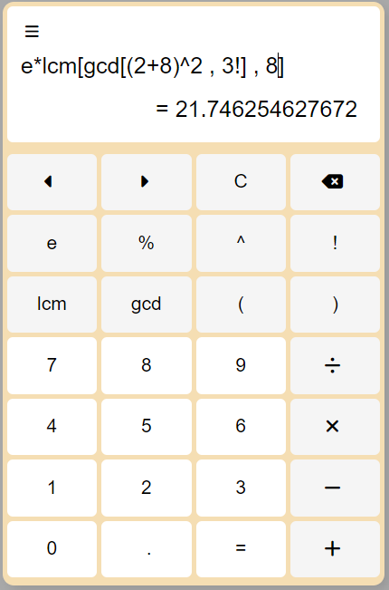

## Normal Calculator App

The Normal Calculator App is a fully-featured calculator with additional functionality and customization options.

### Features

- Basic arithmetic operations (addition, subtraction, multiplication, division).
- Advanced functions (!,lcm, gcm, etc.).
- Customizable settings (theme and history).

### Technologies Used

- HTML
- CSS
- JavaScript
- Ajax
- php
- mysql
