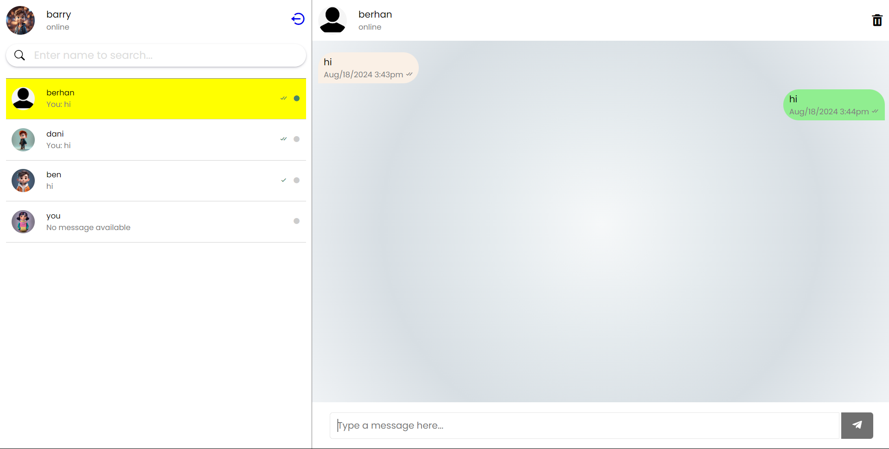

# Web Chat App

## Description

This is a fully functional **Web Chat Application** built with **JavaScript**, **Ajax**, **PHP**, **MySQL**, **HTML**, and **CSS**. The app supports real-time communication with dynamic content loading for a seamless user experience. It's designed to be lightweight, responsive, and easily scalable.

## Features

- 📡 **Real-time communication**: Messages load instantly without refreshing the page, thanks to Ajax.
- 💬 **User-friendly chat interface**: Intuitive and responsive design with HTML/CSS for a smooth experience.
- 📂 **Backend Integration**: Built with PHP and MySQL for handling data storage, user sessions, and message retrieval.
- 🔄 **Dynamic updates**: Messages are updated in real-time using Ajax for smooth, uninterrupted communication.
- 🛠️ **Full-Stack Solution**: A combination of front-end and back-end technologies for end-to-end functionality.

## Technologies Used

- **Frontend**: JavaScript, HTML, CSS
- **Backend**: PHP
- **Database**: MySQL
- **Ajax**: For asynchronous communication between the frontend and backend

 
